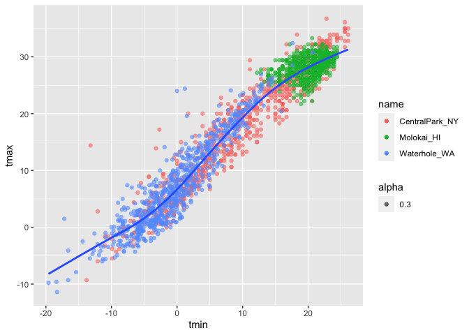
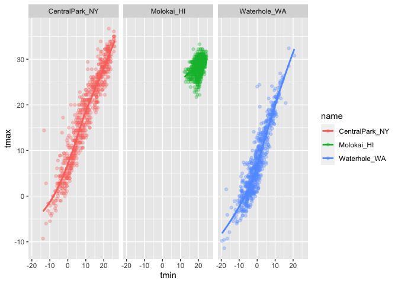
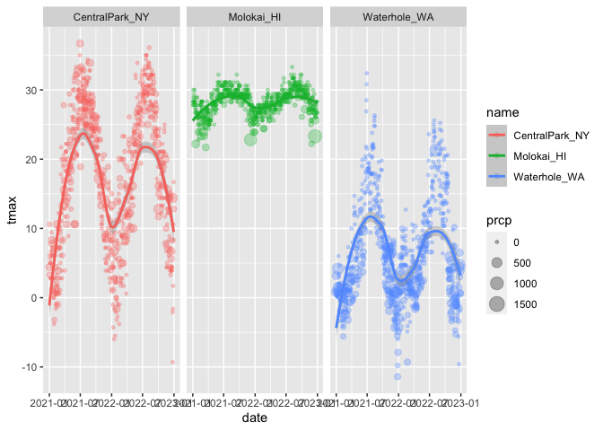
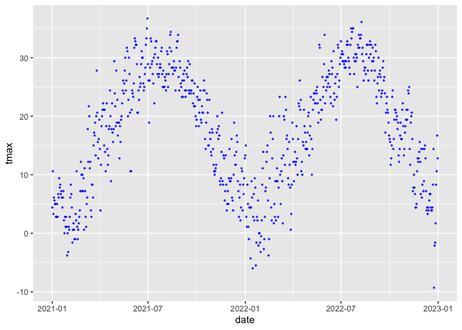
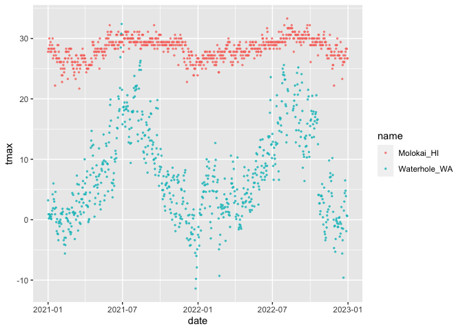
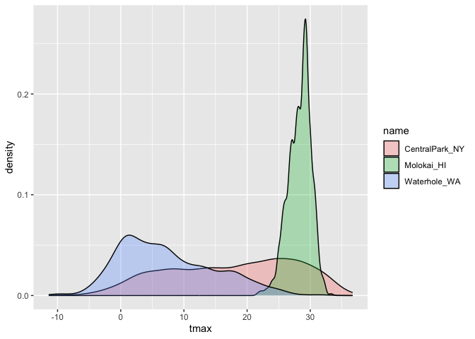
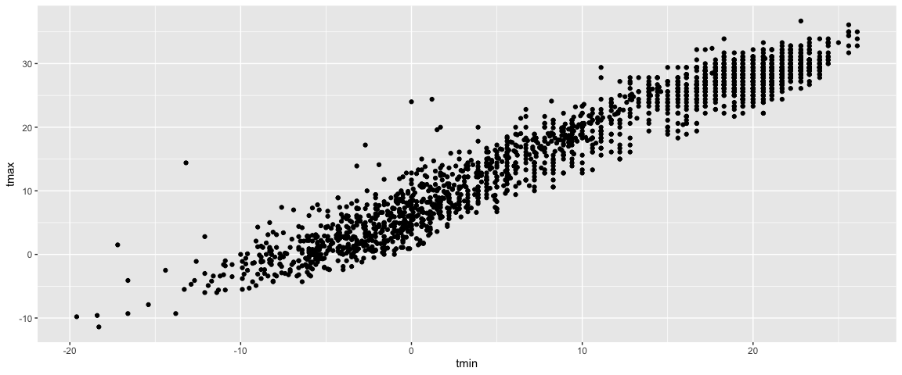

Viz part 1
================

``` r
library(tidyverse)
```

    ## ── Attaching core tidyverse packages ──────────────────────── tidyverse 2.0.0 ──
    ## ✔ dplyr     1.1.3     ✔ readr     2.1.4
    ## ✔ forcats   1.0.0     ✔ stringr   1.5.0
    ## ✔ ggplot2   3.4.3     ✔ tibble    3.2.1
    ## ✔ lubridate 1.9.2     ✔ tidyr     1.3.0
    ## ✔ purrr     1.0.2     
    ## ── Conflicts ────────────────────────────────────────── tidyverse_conflicts() ──
    ## ✖ dplyr::filter() masks stats::filter()
    ## ✖ dplyr::lag()    masks stats::lag()
    ## ℹ Use the conflicted package (<http://conflicted.r-lib.org/>) to force all conflicts to become errors

``` r
library(ggridges)
```

—set the size and scale of plots in md shown up

knitr::opts_chunk\$set( fig.width = 6, fig.asp = .6, out.width = “90%” )

Get the data for plotting today.

``` r
weather_df = 
  rnoaa::meteo_pull_monitors(
    c("USW00094728", "USW00022534", "USS0023B17S"),
    var = c("PRCP", "TMIN", "TMAX"), 
    date_min = "2021-01-01",
    date_max = "2022-12-31") |>
  mutate(
    name = recode(
      id, 
      USW00094728 = "CentralPark_NY", 
      USW00022534 = "Molokai_HI",
      USS0023B17S = "Waterhole_WA"),
    tmin = tmin / 10,
    tmax = tmax / 10) |>
  select(name, id, everything())
```

    ## using cached file: /Users/mac/Library/Caches/org.R-project.R/R/rnoaa/noaa_ghcnd/USW00094728.dly

    ## date created (size, mb): 2023-10-04 16:33:34.519205 (8.527)

    ## file min/max dates: 1869-01-01 / 2023-10-31

    ## using cached file: /Users/mac/Library/Caches/org.R-project.R/R/rnoaa/noaa_ghcnd/USW00022534.dly

    ## date created (size, mb): 2023-10-04 16:33:50.325135 (3.832)

    ## file min/max dates: 1949-10-01 / 2023-10-31

    ## using cached file: /Users/mac/Library/Caches/org.R-project.R/R/rnoaa/noaa_ghcnd/USS0023B17S.dly

    ## date created (size, mb): 2023-10-04 16:33:55.658956 (0.997)

    ## file min/max dates: 1999-09-01 / 2023-10-31

Let’s make a plot!

``` r
ggplot(weather_df,aes(x = tmin, y = tmax)) +
 geom_point()
```

    ## Warning: Removed 17 rows containing missing values (`geom_point()`).

<!-- -->

Pipes and stuff

``` r
weather_df |> 
  filter(name == "CentralPark_NY") |> 
  ggplot(aes(x = tmin, y = tmax)) +
  geom_point()
```

<!-- -->

``` r
ggp_nyc_weather =
  weather_df |> 
  filter(name == "CentralPark_NY") |> 
  ggplot(aes(x = tmin, y = tmax)) +
  geom_point()
```

## Fancy plot

``` r
ggplot(weather_df, aes(x = tmin, y = tmax)) + # if color here, then work for the whole command
  geom_point(aes(color = name, alpha = 0.3))+ # if put color here then no color for smooth,alpha uses to change opqueness and solidness
  geom_smooth(se = FALSE) #by add standard error=FALSE, get rid of error bars,grey area
```

    ## `geom_smooth()` using method = 'gam' and formula = 'y ~ s(x, bs = "cs")'

    ## Warning: Removed 17 rows containing non-finite values (`stat_smooth()`).

    ## Warning: Removed 17 rows containing missing values (`geom_point()`).

<!-- -->

Plot with facets

``` r
ggplot(weather_df, aes(x = tmin, y = tmax, color = name)) +
  geom_point(alpha = 0.3) +
  geom_smooth(se = FALSE)+
  facet_grid(. ~ name) #one pannel in each name variable, central_park...; .put everything in one row, and then separate variable according to name variable according to columns;if name ~.,then 3 rows 1 column
```

    ## `geom_smooth()` using method = 'loess' and formula = 'y ~ x'

    ## Warning: Removed 17 rows containing non-finite values (`stat_smooth()`).

    ## Warning: Removed 17 rows containing missing values (`geom_point()`).

<!-- -->

Let’s try a different plot.temps are boring

``` r
ggplot(weather_df, aes(x = date, y = tmax, color = name))+
  geom_point(aes(size = prcp),alpha = 0.3) + #higher prcp variable have bigger points
  geom_smooth()+
  facet_grid(. ~ name)
```

    ## `geom_smooth()` using method = 'loess' and formula = 'y ~ x'

    ## Warning: Removed 17 rows containing non-finite values (`stat_smooth()`).

    ## Warning: Removed 19 rows containing missing values (`geom_point()`).

<!-- -->

try assigning specific color(#not usually do so, usually assign by
default as the previous chunk)

``` r
weather_df |> 
  filter(name == "CentralPark_NY") |> 
  ggplot(aes(x = date, y = tmax))+ #doing color=blue does not work here
  geom_point(color="blue",alpha=0.7, size=0.5)  #assign color in geom_point function
```

<!-- -->

``` r
weather_df |> 
  filter(name != "CentralPark_NY") |> 
  ggplot(aes(x = date, y = tmax,color = name))+ 
  geom_point(alpha=0.7, size=0.5)  #size&alpha we usually set?
```

    ## Warning: Removed 17 rows containing missing values (`geom_point()`).

<!-- -->

hex plot

``` r
weather_df |> 
  ggplot(aes(x = tmin, y =tmax))+
  geom_hex() #install a package doing density plots;if you have many data over 1000,try do this density plot,each plot occupies some space
```

    ## Warning: Removed 17 rows containing non-finite values (`stat_binhex()`).

<!-- -->

Line plot

``` r
weather_df |> 
  filter(name == "Molokai_HI") |> 
  ggplot(aes(x=date, y =tmax)) +
  geom_line(alpha=0.5) +
  geom_point(size=0.5)
```

    ## Warning: Removed 1 rows containing missing values (`geom_point()`).

<!-- -->

## univariate plotting

only look at one variable easy way to do so histogram

``` r
ggplot(weather_df, aes(x = tmax,fill= name))+ #if use color,outside the bar;here we use fill, fill in the bar with color
  geom_histogram(position = "dodge") #it means bars should avoid each other, not on top of each other
```

    ## `stat_bin()` using `bins = 30`. Pick better value with `binwidth`.

    ## Warning: Removed 17 rows containing non-finite values (`stat_bin()`).

<!-- -->

let’s use a density plot (smooth histogram)

``` r
ggplot(weather_df, aes(x = tmax,fill= name)) +
    geom_density(alpha = 0.3, adjust = 0.75) #adjust-- make smoother
```

    ## Warning: Removed 17 rows containing non-finite values (`stat_density()`).

<!-- -->

using boxplots!

``` r
ggplot(weather_df, aes(y = tmax, x=name))+
  geom_boxplot()
```

    ## Warning: Removed 17 rows containing non-finite values (`stat_boxplot()`).

<!-- -->

violin plots?(all info same as density plot, but order vertically)

``` r
ggplot(weather_df, aes(y = tmax, x=name))+
  geom_violin()
```

    ## Warning: Removed 17 rows containing non-finite values (`stat_ydensity()`).

<!-- -->

ridge plot (crate 3 density, but seprate not overlapping on each top)

``` r
ggplot(weather_df, aes(x = tmax, y=name))+
  geom_density_ridges()
```

    ## Picking joint bandwidth of 1.54

    ## Warning: Removed 17 rows containing non-finite values
    ## (`stat_density_ridges()`).

<!-- -->

## saving and embedding plots

``` r
ggp_weather =
  weather_df |> 
  ggplot(aes(x=tmin,y=tmax))+
  geom_point()

ggp_weather
```

    ## Warning: Removed 17 rows containing missing values (`geom_point()`).

<!-- -->

``` r
ggsave("resulted plots/ggp_weather.pdf", ggp_weather)
```

    ## Saving 7 x 5 in image

    ## Warning: Removed 17 rows containing missing values (`geom_point()`).

change the scale of plot (#for md shown after git)

``` r
ggp_weather
```

    ## Warning: Removed 17 rows containing missing values (`geom_point()`).

<!-- -->

(#fig.asp=0.6, a little bit wider than its height)

``` r
ggp_weather
```

    ## Warning: Removed 17 rows containing missing values (`geom_point()`).

<!-- -->
