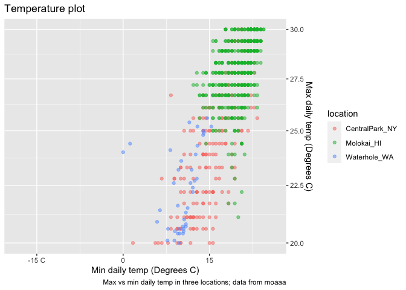
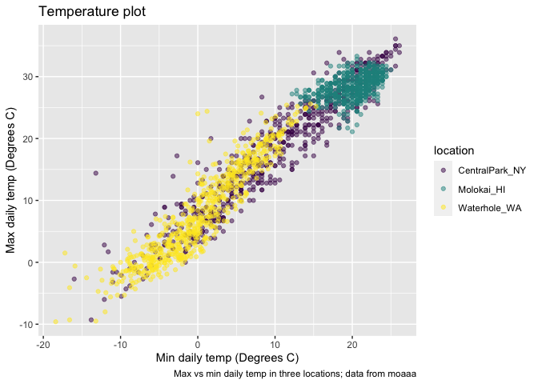

Viz part 1
================

``` r
library(tidyverse)
```

    ## ── Attaching core tidyverse packages ──────────────────────── tidyverse 2.0.0 ──
    ## ✔ dplyr     1.1.3     ✔ readr     2.1.4
    ## ✔ forcats   1.0.0     ✔ stringr   1.5.0
    ## ✔ ggplot2   3.4.3     ✔ tibble    3.2.1
    ## ✔ lubridate 1.9.2     ✔ tidyr     1.3.0
    ## ✔ purrr     1.0.2     
    ## ── Conflicts ────────────────────────────────────────── tidyverse_conflicts() ──
    ## ✖ dplyr::filter() masks stats::filter()
    ## ✖ dplyr::lag()    masks stats::lag()
    ## ℹ Use the conflicted package (<http://conflicted.r-lib.org/>) to force all conflicts to become errors

—set the size and scale of plots in md shown up

knitr::opts_chunk\$set( fig.width = 6, fig.asp = .6, out.width = “90%” )

Get the data for plotting today.

``` r
weather_df = 
  rnoaa::meteo_pull_monitors(
    c("USW00094728", "USW00022534", "USS0023B17S"),
    var = c("PRCP", "TMIN", "TMAX"), 
    date_min = "2021-01-01",
    date_max = "2022-12-31") |>
  mutate(
    name = recode(
      id, 
      USW00094728 = "CentralPark_NY", 
      USW00022534 = "Molokai_HI",
      USS0023B17S = "Waterhole_WA"),
    tmin = tmin / 10,
    tmax = tmax / 10) |>
  select(name, id, everything())
```

    ## using cached file: /Users/mac/Library/Caches/org.R-project.R/R/rnoaa/noaa_ghcnd/USW00094728.dly

    ## date created (size, mb): 2023-10-04 16:33:34.519205 (8.527)

    ## file min/max dates: 1869-01-01 / 2023-10-31

    ## using cached file: /Users/mac/Library/Caches/org.R-project.R/R/rnoaa/noaa_ghcnd/USW00022534.dly

    ## date created (size, mb): 2023-10-04 16:33:50.325135 (3.832)

    ## file min/max dates: 1949-10-01 / 2023-10-31

    ## using cached file: /Users/mac/Library/Caches/org.R-project.R/R/rnoaa/noaa_ghcnd/USS0023B17S.dly

    ## date created (size, mb): 2023-10-04 16:33:55.658956 (0.997)

    ## file min/max dates: 1999-09-01 / 2023-10-31

## Same plot from last time

``` r
weather_df |> 
  ggplot(aes(x=tmin, y=tmax, color=name)) +
  geom_point(alpha=0.5)+
  labs(
    title = "Temperature plot",
    x= "Min daily temp (Degrees C)",
    y= "Max daily temp (Degrees C)",
    color = "location",
    caption = "Max vs min daily temp in three locations; data from moaaa"
  )+ #updating lables
  scale_x_continuous(
    breaks =c(-15,0,15),
    labels = c("-15 C", "0", "15")
  ) +
    scale_y_continuous(
      position = "right",
      trans = "sqrt", #square transformations
      limits = c(20,30) #here not updating x aixs, but if we filter at start, then x axis is also updating with y in(20,30)
  )
```

    ## Warning in self$trans$transform(x): NaNs produced

    ## Warning: Transformation introduced infinite values in continuous y-axis

    ## Warning: Removed 1227 rows containing missing values (`geom_point()`).

<!-- -->

what about color…

``` r
weather_df |> 
  ggplot(aes(x=tmin, y=tmax, color=name)) +
  geom_point(alpha=0.5)+
  labs(
    title = "Temperature plot",
    x= "Min daily temp (Degrees C)",
    y= "Max daily temp (Degrees C)",
    color = "location",
    caption = "Max vs min daily temp in three locations; data from moaaa"
  )+
 viridis::scale_color_viridis(discrete = TRUE)
```

    ## Warning: Removed 17 rows containing missing values (`geom_point()`).

<!-- -->

``` r
  #use  viridis color package generally is better
```
