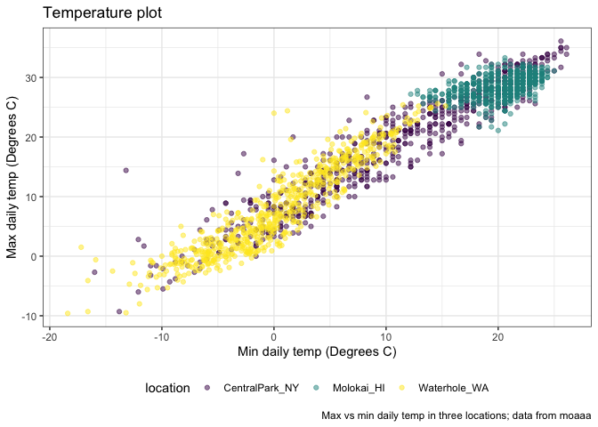
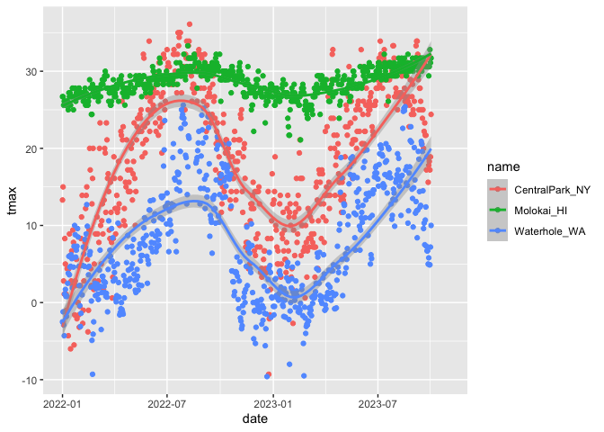
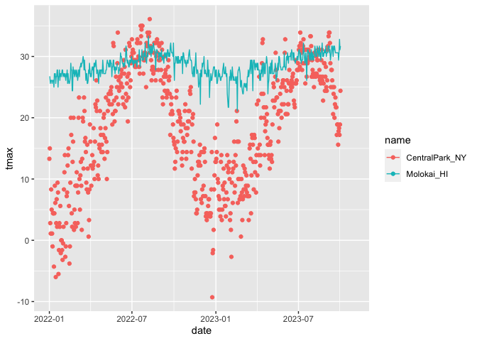
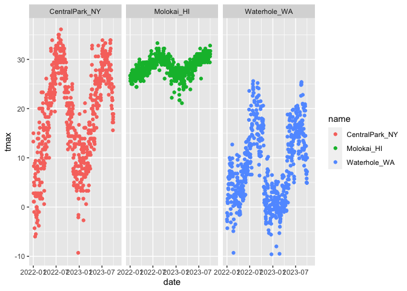
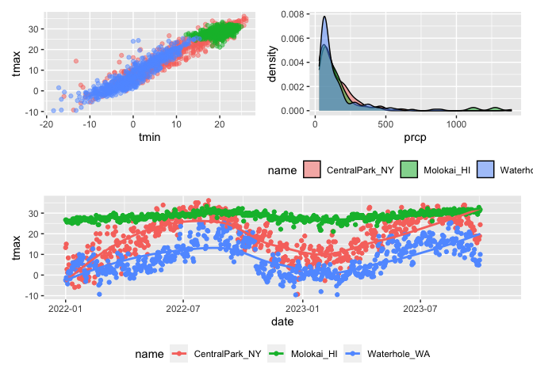
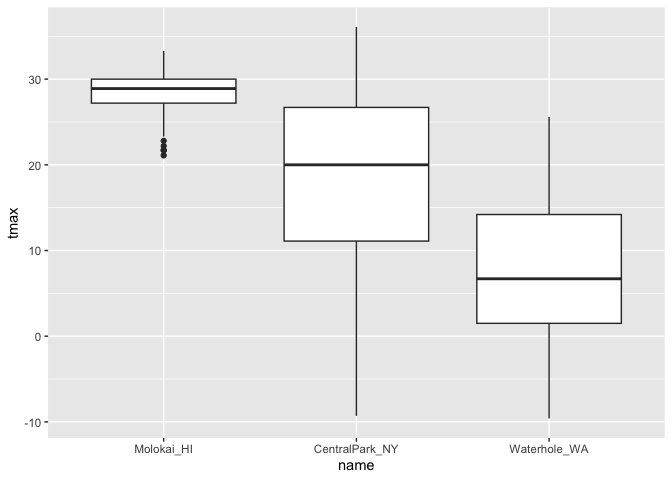
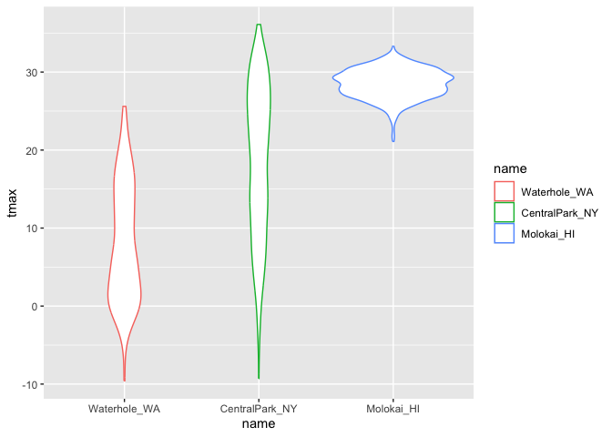
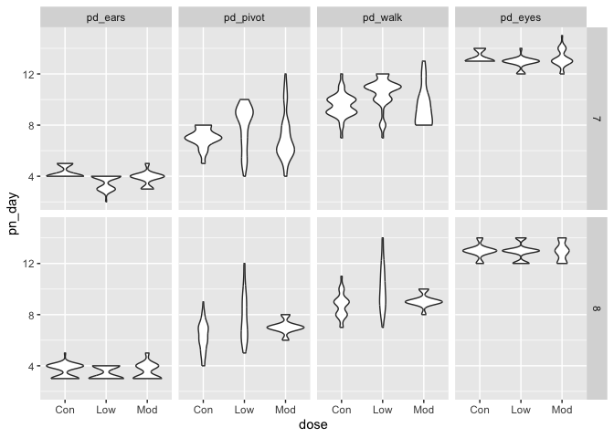

Viz part 1
================

``` r
library(tidyverse)
```

    ## ── Attaching core tidyverse packages ──────────────────────── tidyverse 2.0.0 ──
    ## ✔ dplyr     1.1.3     ✔ readr     2.1.4
    ## ✔ forcats   1.0.0     ✔ stringr   1.5.0
    ## ✔ ggplot2   3.4.3     ✔ tibble    3.2.1
    ## ✔ lubridate 1.9.2     ✔ tidyr     1.3.0
    ## ✔ purrr     1.0.2     
    ## ── Conflicts ────────────────────────────────────────── tidyverse_conflicts() ──
    ## ✖ dplyr::filter() masks stats::filter()
    ## ✖ dplyr::lag()    masks stats::lag()
    ## ℹ Use the conflicted package (<http://conflicted.r-lib.org/>) to force all conflicts to become errors

``` r
library(patchwork)
```

—set the size and scale of plots in md shown up

knitr::opts_chunk\$set( fig.width = 6, fig.asp = .6, out.width = “90%” )

Get the data for plotting today.

``` r
weather_df = 
  rnoaa::meteo_pull_monitors(
    c("USW00094728", "USW00022534", "USS0023B17S"),
    var = c("PRCP", "TMIN", "TMAX"), 
    date_min = "2022-01-01",
    date_max = "2023-12-31") |>
  mutate(
    name = recode(
      id, 
      USW00094728 = "CentralPark_NY", 
      USW00022534 = "Molokai_HI",
      USS0023B17S = "Waterhole_WA"),
    tmin = tmin / 10,
    tmax = tmax / 10) |>
  select(name, id, everything())
```

    ## using cached file: /Users/mac/Library/Caches/org.R-project.R/R/rnoaa/noaa_ghcnd/USW00094728.dly

    ## date created (size, mb): 2023-10-04 16:33:34.519205 (8.527)

    ## file min/max dates: 1869-01-01 / 2023-10-31

    ## using cached file: /Users/mac/Library/Caches/org.R-project.R/R/rnoaa/noaa_ghcnd/USW00022534.dly

    ## date created (size, mb): 2023-10-04 16:33:50.325135 (3.832)

    ## file min/max dates: 1949-10-01 / 2023-10-31

    ## using cached file: /Users/mac/Library/Caches/org.R-project.R/R/rnoaa/noaa_ghcnd/USS0023B17S.dly

    ## date created (size, mb): 2023-10-04 16:33:55.658956 (0.997)

    ## file min/max dates: 1999-09-01 / 2023-10-31

This results in a dataframe with 2007 obervations on six variables

## Same plot from last time

``` r
weather_df |> 
  ggplot(aes(x=tmin, y=tmax, color=name)) +
  geom_point(alpha=0.5)+
  labs(
    title = "Temperature plot",
    x= "Min daily temp (Degrees C)",
    y= "Max daily temp (Degrees C)",
    color = "location",
    caption = "Max vs min daily temp in three locations; data from moaaa"
  )+ #updating lables
  scale_x_continuous(
    breaks =c(-15,0,15),
    labels = c("-15 C", "0", "15")
  ) +
    scale_y_continuous(
      position = "right",
      trans = "sqrt", #square transformations
      limits = c(20,30) #here not updating x aixs, but if we filter at start, then x axis is also updating with y in(20,30)
  )
```

    ## Warning in self$trans$transform(x): NaNs produced

    ## Warning: Transformation introduced infinite values in continuous y-axis

    ## Warning: Removed 1197 rows containing missing values (`geom_point()`).

<!-- -->

what about color…

``` r
weather_df |> 
  ggplot(aes(x=tmin, y=tmax, color=name)) +
  geom_point(alpha=0.5)+
  labs(
    title = "Temperature plot",
    x= "Min daily temp (Degrees C)",
    y= "Max daily temp (Degrees C)",
    color = "location",
    caption = "Max vs min daily temp in three locations; data from moaaa"
  )+
 viridis::scale_color_viridis(discrete = TRUE)
```

    ## Warning: Removed 105 rows containing missing values (`geom_point()`).

<!-- -->

``` r
  #use  viridis color package generally is better
```

## Themes

``` r
weather_df |> 
  ggplot(aes(x=tmin, y=tmax, color=name)) +
  geom_point(alpha=0.5)+
  labs(
    title = "Temperature plot",
    x= "Min daily temp (Degrees C)",
    y= "Max daily temp (Degrees C)",
    color = "location",
    caption = "Max vs min daily temp in three locations; data from moaaa"
  )+
 viridis::scale_color_viridis(discrete = TRUE) +
  theme_bw()+ #black white background;this is reset everything of theme, so put it in front of other theme instructions;theme_classi---removing grids;theme_minimal---b&w without boxline at the outside
  theme(legend.position = "bottom") #moving notations to bottom
```

    ## Warning: Removed 105 rows containing missing values (`geom_point()`).

<!-- -->

## data argument…

``` r
weather_df |> 
  ggplot(aes(x=date, y=tmax, color=name)) +
  geom_point()+
  geom_smooth()
```

    ## `geom_smooth()` using method = 'loess' and formula = 'y ~ x'

    ## Warning: Removed 105 rows containing non-finite values (`stat_smooth()`).

    ## Warning: Removed 105 rows containing missing values (`geom_point()`).

<!-- -->

``` r
nyc_weather_df=
  weather_df |> 
  filter(name == "CentralPark_NY")

hawaii_weather_df=
  weather_df |> 
  filter(name == "Molokai_HI")

ggplot(nyc_weather_df,aes(x=date, y=tmax,color=name))+
  geom_point()+
  geom_line(data=hawaii_weather_df)
```

    ## Warning: Removed 30 rows containing missing values (`geom_point()`).

    ## Warning: Removed 30 rows containing missing values (`geom_line()`).

<!-- -->

## `patchwork`

``` r
weather_df |> 
  ggplot(aes(x=date, y=tmax, color=name)) +
  geom_point()+
  facet_grid(.~ name) #. no faceting on the rows, name faceting on the columns
```

    ## Warning: Removed 105 rows containing missing values (`geom_point()`).

<!-- -->

``` r
ggp_temp_scatter =
  weather_df |> 
  ggplot(aes(x=tmin, y=tmax, color=name)) +
  geom_point(alpha=0.5)+
  theme(legend.position = "none") #no notations; if bottom,put on bottom


ggp_prcp_density =
  weather_df |> 
  filter(prcp > 25) |> 
  ggplot(aes(x=prcp, fill=name))+
  geom_density(alpha = 0.5)+
  theme(legend.position = "bottom")

ggp_tmax_date=
  weather_df |> 
  ggplot(aes(x=date, y=tmax, color=name)) +
  geom_point()+
  geom_smooth(se = FALSE)+
  theme(legend.position = "bottom")
  

(ggp_temp_scatter + ggp_prcp_density)/ggp_tmax_date # through patchwork package, put plots together
```

    ## Warning: Removed 105 rows containing missing values (`geom_point()`).

    ## `geom_smooth()` using method = 'loess' and formula = 'y ~ x'

    ## Warning: Removed 105 rows containing non-finite values (`stat_smooth()`).
    ## Removed 105 rows containing missing values (`geom_point()`).

<!-- -->

## data manipulation

``` r
weather_df |> 
  mutate(
    name= fct_relevel(name,c("Molokai_HI", "CentralPark_NY", "Waterhole_WA"))
  ) |> #reorder x axis in this order
  ggplot(aes(x=name, y=tmax))+
  geom_boxplot()
```

    ## Warning: Removed 105 rows containing non-finite values (`stat_boxplot()`).

<!-- -->

``` r
weather_df |> 
  mutate(
    name = fct_reorder(name, tmax)
  ) |> #reoder in tmax average order
    ggplot(aes(x=name, y=tmax,color=name))+
    geom_violin()
```

    ## Warning: There was 1 warning in `mutate()`.
    ## ℹ In argument: `name = fct_reorder(name, tmax)`.
    ## Caused by warning:
    ## ! `fct_reorder()` removing 105 missing values.
    ## ℹ Use `.na_rm = TRUE` to silence this message.
    ## ℹ Use `.na_rm = FALSE` to preserve NAs.

    ## Warning: Removed 105 rows containing non-finite values (`stat_ydensity()`).

<!-- -->

## complicate FAS plot

``` r
litters_df =
  read_csv("data/FAS_litters.csv") |> 
  janitor::clean_names() |> 
  separate(group, into= c("dose", "day_of_tx"),sep=3)
```

    ## Rows: 49 Columns: 8
    ## ── Column specification ────────────────────────────────────────────────────────
    ## Delimiter: ","
    ## chr (2): Group, Litter Number
    ## dbl (6): GD0 weight, GD18 weight, GD of Birth, Pups born alive, Pups dead @ ...
    ## 
    ## ℹ Use `spec()` to retrieve the full column specification for this data.
    ## ℹ Specify the column types or set `show_col_types = FALSE` to quiet this message.

``` r
pups_df=
  read.csv("data/FAS_pups.csv") |> 
    janitor::clean_names() 

fas_df=
  left_join(pups_df, litters_df, by = "litter_number")

fas_df |> 
 select(dose, day_of_tx, starts_with ("pd")) |> 
 pivot_longer(
   pd_ears:pd_walk,
   names_to = "outcome",
   values_to = "pn_day"
 ) |> 
  drop_na() |> 
  mutate(outcome= fct_reorder(outcome, pn_day)) |> 
  ggplot(aes(x=dose, y=pn_day)) +
  geom_violin() +
  facet_grid(day_of_tx ~ outcome)
```

<!-- -->
